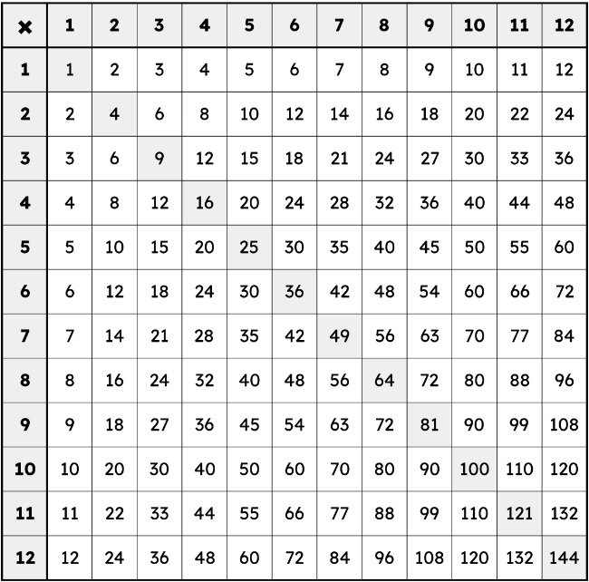

# Chapter 1: Beginnings

So, you made it.  
So anyway, see these?  
__1 2 3 4 5 6 7 8 9 10__  
Those are numbers. These monsters either make life better, make life painful, or give people existential fears!
::: info FUN FACT!
Did you know, our universe could be in a false vaccum state? That means that if it ever became a true vaccum, it would rewrite the laws of physics and end life as we know it! And we can never stop it or know if it's coming!
:::

Anyway, see these?  
🌟🌟🌟🌟🌟  
How many are there. Tell me. You can count, right? If you can't that's no bueno!  
Good, anyway now tell me how many there are of these  
🌟🌟🌟  
And now  C O M B I N E  them.  
🌟🌟🌟🌟🌟🌟🌟🌟  
Very good!
Now we need to ~~ELIMINATE~~ subtract three of them!  
🌟🌟🌟🌟🌟  
What if we just add like a lot of times  
🌟🌟🌟  
🌟🌟🌟  
🌟🌟🌟  
What if it was called MULTIPLICATION  
And we had a really weird thing to make it easier  
  
Well that looks disgusting. I guess it works though.  
Hey what if we did it in reverse.  
And that's division.

WAIT WHAT IS THAT CREATURE  
$x$  
Continued in Chapter 2
